# Spider Bot

This project is to develop legged inspection robot to use in rough terrian or narrow cieling area.

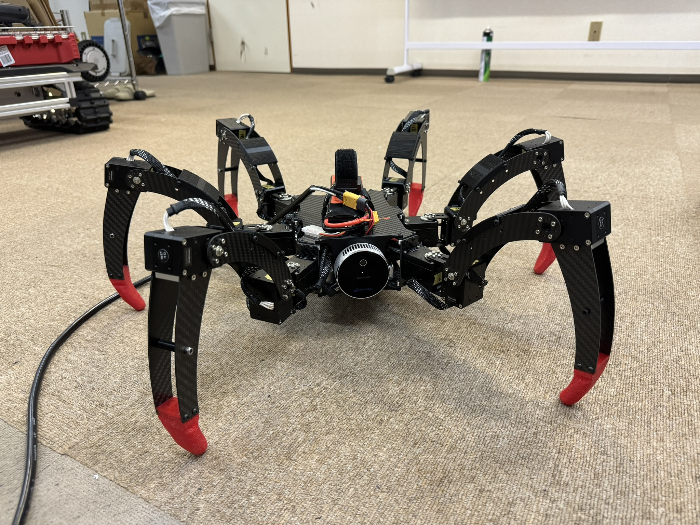 

## Features

- **Flat-Walking**; normal walking mode which is the fatest movement.The motion of walking is like a Crab-Walking which the robot is keeping orientation during walking, and also turning in-place to change the heading angle.
- **Orientation Control**; control the body's orientation to roll-pitch-yaw. This is like a gimbal control motion for camera.
- **Rough-Walking**; walking in rough terrian where there are many obstacle or rock laying on the ground. The leg is trying to adapt and climb to overcome those object.
- **Inspection Mode**; no walking in this mode just stay still and use front left/right legs to touch on unknown object in front, then predict whether the object is soft or hard objects.

## Hardware

- Jetson Nano 4GB
- JMOAB
- Dynamixel XM430-W350-R 18pcs
- U2D2 RS485-USB converter
- Futaba RC receiver
- BNO055
- Intel Realsenes L515
- GL-iNet WiFi router
- 5V DCDC regulator
- 3S LiPo battery

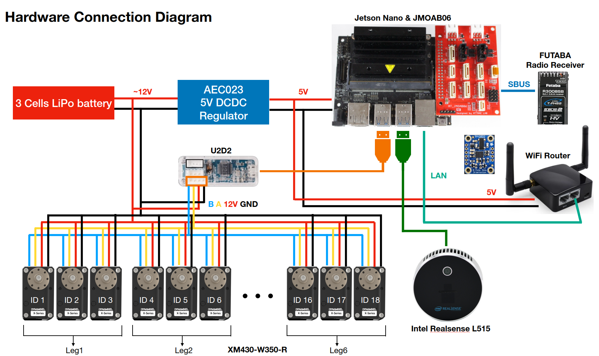 

## Software

This robot is running on ROS2 for data transportation between nodes.

- ROS2 galactic
- jmoab_ros2 package

The jmoab_ros2 package is used to help for some other hardware interface such as connect Radio Controller (Futaba RC receiver) via SBUS port, so we can control robot from RC transmitter. The application level code is this package **spider_bot** which contains `spider_bot_control` and `realsense_handler`. The topics from `atcart_basic` in `/jmoab/***` namespace will be subscribed on `spider_bot_control` and the topic which namespace `/spider/**` are used fro communicate between **Web Stack** level and **Apllication Program** level. 

The web stack program is made from another package called **spider_bot_console** in order to allow user to control robot easily via web console.

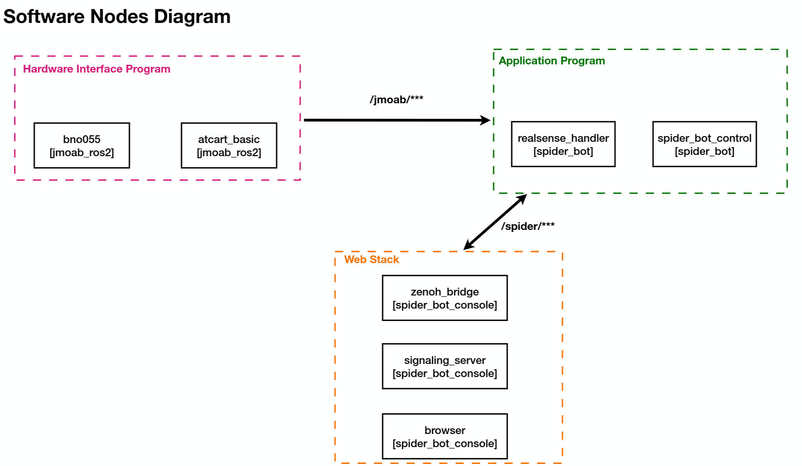 

## Frames and Parameters

The robot has six legs, 1st leg is on right side center (from top view), and 2nd, 3rd, until 6th are rotate in CCW direction. In the code in *SpiderBotLib.py* you could see sometime legs are metioned as i,j,k,l,m,n legs that is similar to 1,2,3,4,5,6 legs in same order. All of the walking motion will be calculated in Leg1 then for other legs we will apply transformation matrix to moves the point to each leg frames.

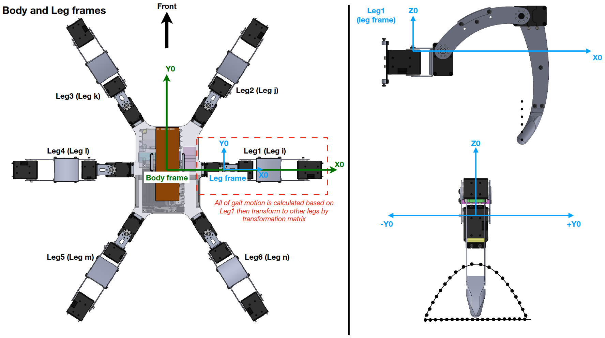 

There are some necessary parameters, if the design or length has changed, these have to be considered.

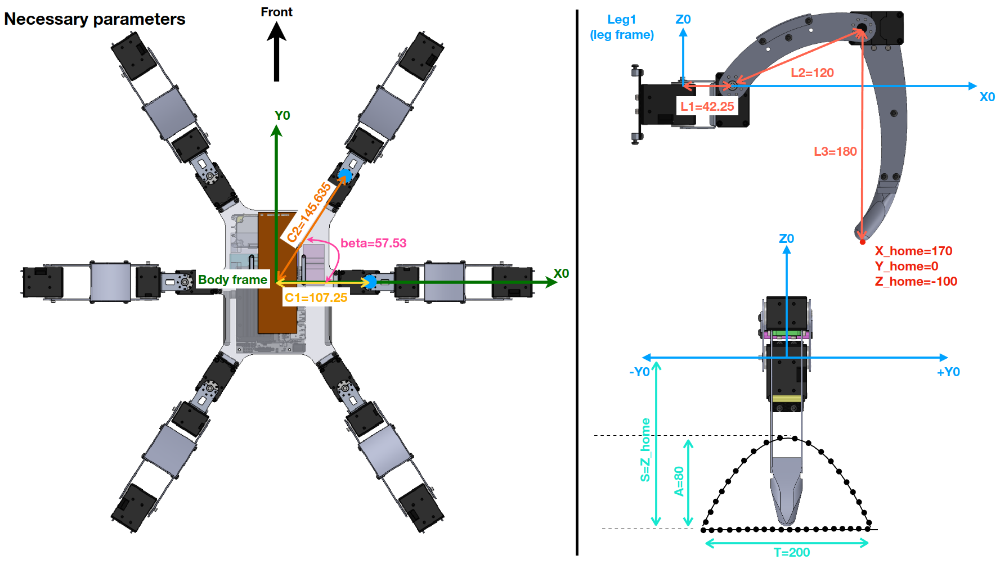 

## Gait and Walking Motion Design

Gait is the sequence of how to move the leg to make the body walking. In here we're using two main gaits

- Tripod Gait
- Wave Gait

### Tripod Gait

The most stable and fatest walking gait for hexapod is trigait. So there will always be three legs on the ground and thee leg on the air. The curve motion can be derived by any equation but here we're using Bezier's Curve.

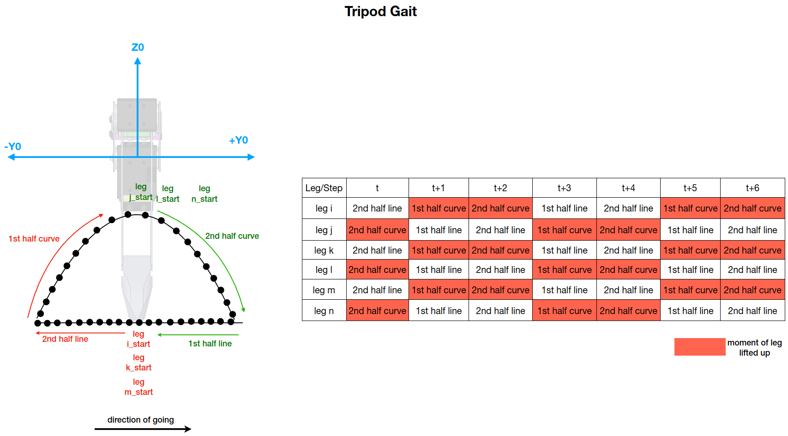 

The leg as shown in figure is leg 1, then for the trigait leg 1,3,5 will always have the same set of moving pattern, and leg 2,4,6 will have the same. 

### Wave Gait

This gait is to move one leg up in the air at a time, so it is used for Rough-Walking mode where all the servo's mode will be changed to *Current-Based Position Control* so it will have some damping effect on the joints. The other five legs will always be touching the ground to support bodyweight.

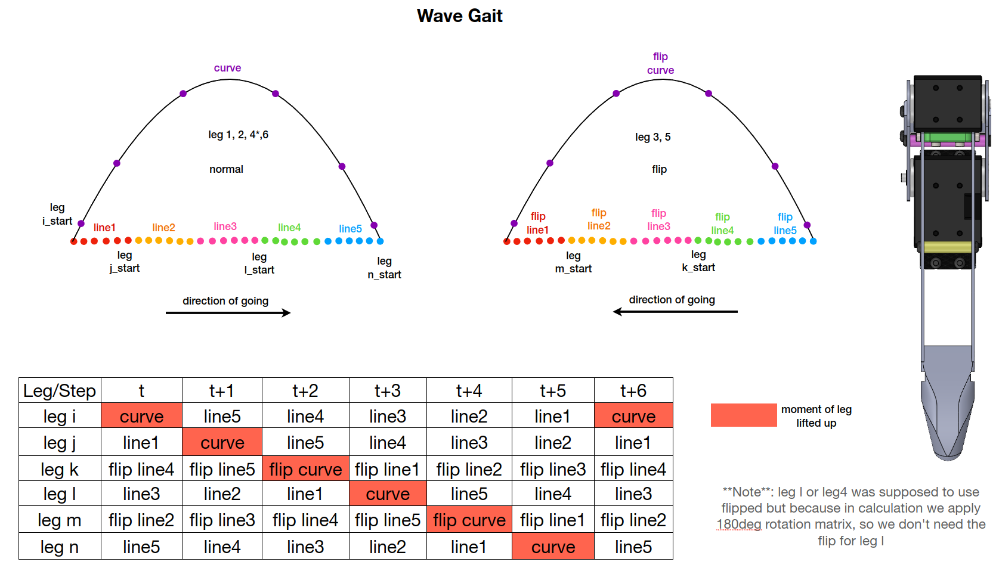 

## Machine Learning for Inspection

We're planning to use two legs on front for an inspection of unknown object to determine wheter it's hard or soft object. The idea concept of how to classify between two objects is explained in the fiture below.

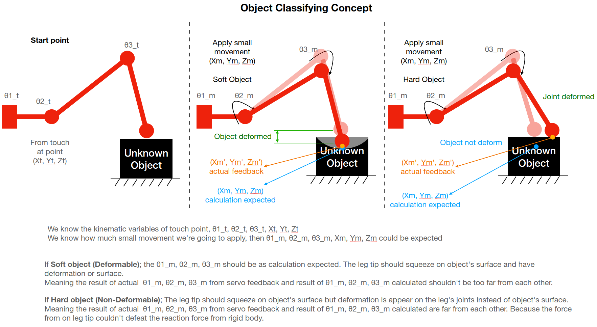 

There are five independent variables which can describe soft/hard object. So we made the ML model by using Support Vector Machine to learn on the dataset and find the best hyperplane to divide soft or hard objects.

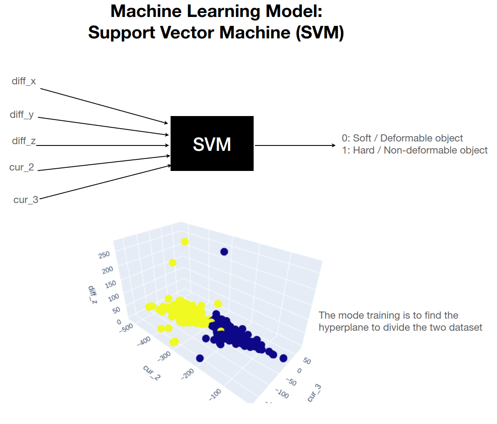

The candidate objects that we're using to get the trained data are as following,

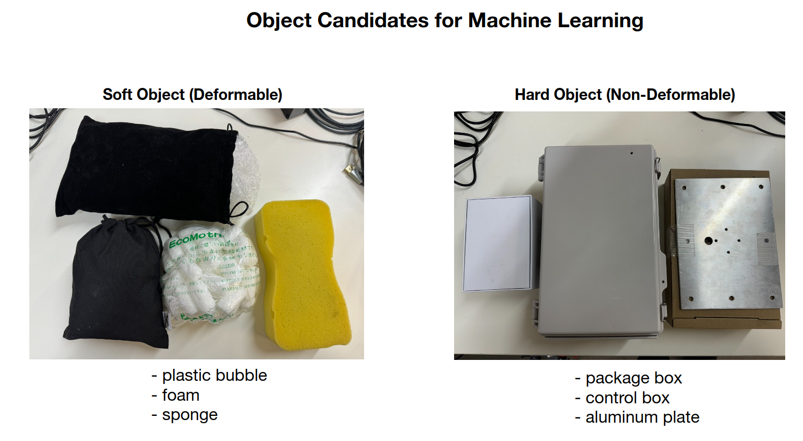

The data is colleceted to have around 300 data of soft and 300 data of hard objects.

So in the Inspection Mode, here is the algorithm,

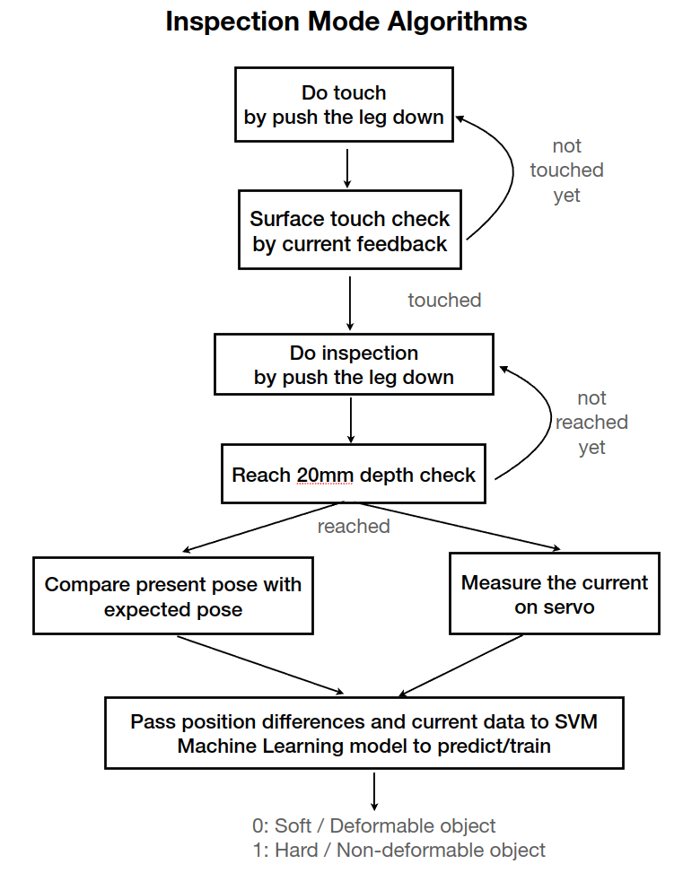

## Console

As mention eariler that the web console is made in another package called **spider_bot_console**, here is the sample UI to control the robot.

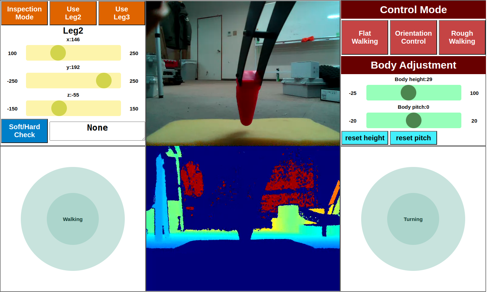

